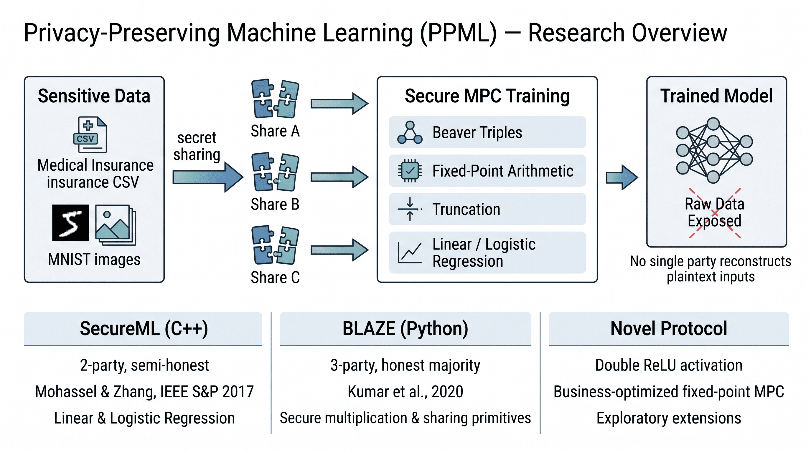

# Privacy-Preserving Machine Learning (PPML)

[]()
[]()
[]()
[](secureml/)
[](blaze/)
[](LICENSE)

Research implementation and evaluation of secure multi-party machine learning protocols, developed during a **research internship at Mphasis Lab, Ashoka University** (May–August 2021).

**Advisor:** Prof. Mahavir Jhawar

## Overview

This repository contains implementations and experiments for **Privacy-Preserving Machine Learning (PPML)** — training and evaluating ML models on sensitive data without exposing raw inputs to any single party.

<p align="center">
  
</p>

The work focuses on:

1. **SecureML** — A C++ implementation of the two-party secure training protocol from Mohassel & Zhang (IEEE S&P 2017), supporting linear and logistic regression on tabular and image datasets.
2. **BLAZE** — A Python prototype of the three-party BLAZE framework (Kumar et al., 2020) with secure multiplication, truncation, and sharing primitives.
3. **Novel protocol research** — Exploratory work on optimized activation functions (Double ReLU) and fixed-point arithmetic for business-specific PPML use cases.

The goal was to compare protocol efficiency and security trade-offs, then extend the most promising approaches for real-world deployment scenarios.

---

## Repository Structure

```
mphasis_ppml/
├── assets/            # README figures and diagrams
├── secureml/          # C++ SecureML implementation (linear & logistic regression)
├── blaze/             # Python BLAZE protocol primitives and tests
├── novel/             # Custom protocol research (Double ReLU, fixed-point MPC)
├── datasets/          # Sample datasets and preprocessing notebooks
├── experiments/       # Auxiliary prototypes and unit tests
├── bin/               # Compiled executables (generated)
└── build/             # Object files (generated)
```

| Directory | Description |
|-----------|-------------|
| [`assets/`](assets/) | Overview diagram and other documentation figures |
| [`secureml/`](secureml/) | Two-party secure ML training in C++ with Eigen |
| [`blaze/`](blaze/) | Three-party BLAZE protocol in Python |
| [`novel/`](novel/) | Research notes and prototypes for custom PPML extensions |
| [`datasets/`](datasets/) | Medical insurance splits, MNIST archive, preprocessing notebooks |
| [`experiments/`](experiments/) | Truncation tests, OT experiments, and helper scripts |

---

## Getting Started

### Prerequisites

**SecureML (C++)**

- [Eigen](https://eigen.tuxfamily.org/) — linear algebra
- `g++` with C++14 support

If Eigen is not on the default include path (common on macOS with Homebrew):

```bash
make EIGEN_INCLUDE=/opt/homebrew/include/eigen3
```

**BLAZE (Python)**

- Python 3.7+
- `numpy`, `gmpy2` — install via `pip install -r blaze/requirements.txt`

**Experiments (optional)**

- [emp-ot](https://github.com/emp-toolkit/emp-ot) — only required for `experiments/ot-test.cpp`

### Build & Run SecureML

From the repository root:

```bash
make linear    # secure linear regression
make logistic  # secure logistic regression

./bin/linear    # run from repository root
./bin/logistic
```

Both programs prompt for a dataset:

| Option | Dataset |
|--------|---------|
| 1 | MNIST (requires extraction — see [datasets/README.md](datasets/README.md)) |
| 2 | Medical insurance (included) |
| 3 | Binary MNIST (requires generation — see [Binary MNIST generation.ipynb](datasets/Binary%20MNIST%20generation.ipynb)) |
| 4 | Sanity-check toy data |

### Run BLAZE Tests

```bash
pip install -r blaze/requirements.txt
cd blaze
python3 main.py    # primitive and sharing semantics tests
python3 main2.py   # extended protocol tests
```

---

## Protocols & References

| Protocol | Setting | Paper |
|----------|---------|-------|
| **SecureML** | 2-party, semi-honest | [Mohassel & Zhang, IEEE S&P 2017](https://ieeexplore.ieee.org/document/7958569) |
| **BLAZE** | 3-party, honest majority | [Kumar et al., 2020](https://eprint.iacr.org/2020/042.pdf) |

### Key Techniques

- **Secret sharing** — Additive and special (three-party) sharing schemes
- **Beaver triples** — Secure multiplication without revealing inputs
- **Fixed-point arithmetic** — Integer-ring embeddings with configurable precision (13–18 bit scaling)
- **Truncation** — Post-multiplication fixed-point reduction to control overflow

---

## Limitations

This is **research prototype code**, not a production-ready secure ML framework:

- Semi-honest security assumptions; no formal side-channel hardening
- Fixed-point precision and truncation parameters are dataset-dependent
- MNIST and binary MNIST require manual setup (see `datasets/`)
- Some BLAZE networking paths are stubbed for local testing

---

## License

Released under the [MIT License](LICENSE).
